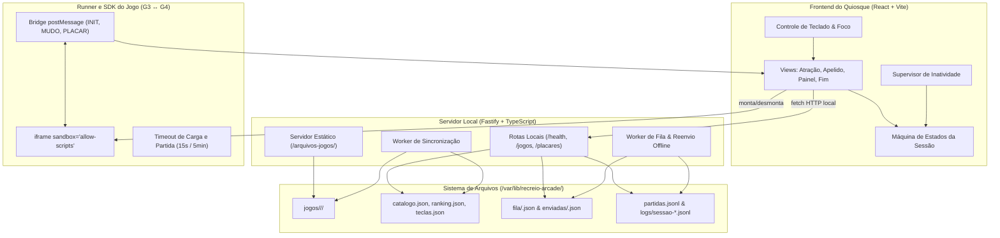
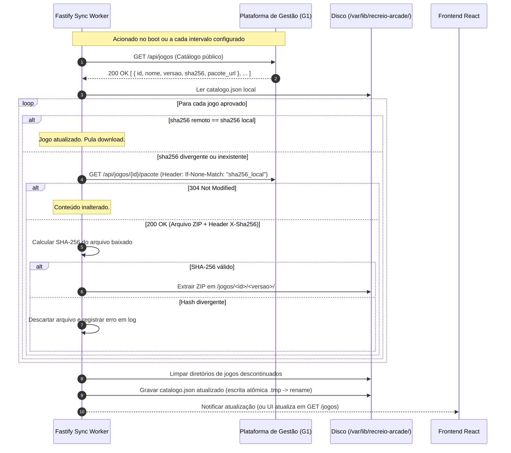
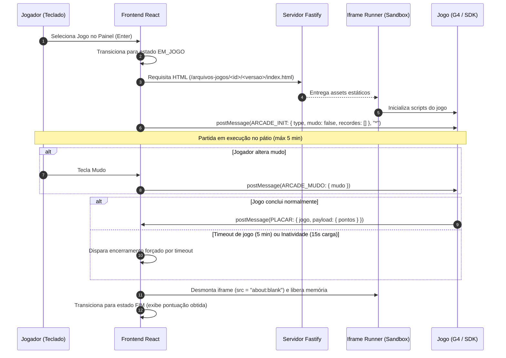
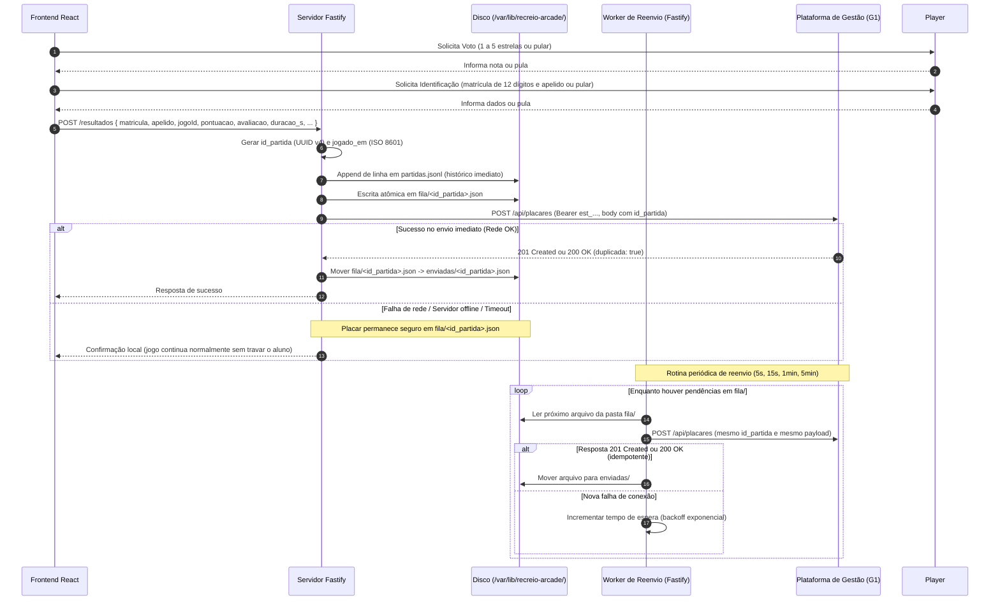
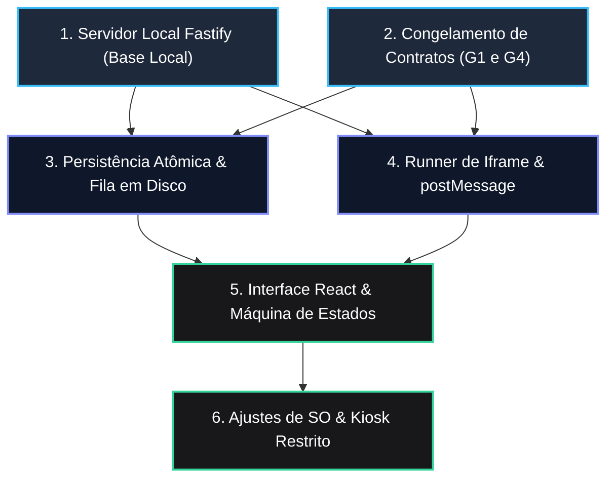
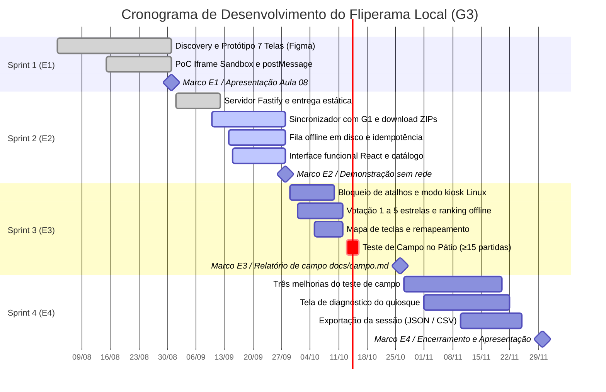

# Arquitetura e roadmap de desenvolvimento: Fliperama Local (G3)

Estrutura técnica e cronograma de implementação da estação local do Recreio Arcade (Grupo 03). O documento descreve os componentes do quiosque, os fluxos de comunicação, as dependências de implementação, o planejamento das quatro entregas do semestre (E1 a E4) e o escopo da Sprint 1.

## 1. Visão geral e diretrizes técnicas

A estação do fliperama roda em um computador instalado no pátio do IFES. Os alunos jogam títulos desenvolvidos pela turma (G4), enquanto a máquina registra as pontuações e recebe avaliações sem precisar de operador ou conexão contínua com a internet.

```text
                      +------------------------------------------+
                      |   Plataforma de Gestão Central (G1)      |
                      |   (Catálogo oficial, pacotes, placares)  |
                      +------------------------------------------+
                                           ▲
                            HTTPS (Sync catálogo / Envio placar)
                                           ▼
+---------------------------------------------------------------------------------+
| QUIOSQUE FÍSICO DO PÁTIO (G3: Linux 4 GB RAM, 200 GB HD, Monitor 4:3, Teclado)  |
|                                                                                 |
|  +------------------------+                 +--------------------------------+  |
|  | Frontend React + Vite  | ◄-- HTTP/IPC -► | Servidor Local Fastify         |  |
|  | (Kiosk 1024×768,       |                 | (Node.js, static server, sync, |  |
|  |  navegação só teclado) |                 |  fila e reenvio de placares)   |  |
|  +------------------------+                 +--------------------------------+  |
|              ▲                                               ▲                  |
|  postMessage | (ARCADE_INIT, PLACAR)                         | fs (atômico)     |
|              ▼                                               ▼                  |
|  +------------------------+                 +--------------------------------+  |
|  | Runner Iframe Sandbox  | ◄-- Assets ---- | Sistema de Arquivos Local      |  |
|  | (allow-scripts isolado)|                 | (/var/lib/recreio-arcade/)     |  |
|  +------------------------+                 +--------------------------------+  |
+---------------------------------------------------------------------------------+
```

### Diretrizes de arquitetura

- Operação offline por padrão (RF-L02): o quiosque inicializa, navega pelo catálogo, executa partidas e armazena resultados mesmo sem internet. A rede é usada apenas para sincronizar pacotes e descarregar placares pendentes.
- Isolamento dos jogos (RF-L05, RNF-L06): cada jogo roda dentro de `<iframe sandbox="allow-scripts">` sem `allow-same-origin`. O código do jogo não acessa cookies, armazenamento local nem o sistema de arquivos do quiosque.
- Tolerância a falhas elétricas (RF-L15, RNF-L04): o computador pode ser desligado puxando o cabo da tomada. Arquivos de estado usam gravação em arquivo temporário com renomeação atômica (`fs.rename`), e o registro de partidas usa formato append-only (`.jsonl`).
- Idempotência no envio de placares (RF-L08): cada partida recebe um UUID (`id_partida`) ao terminar. Repetições de envio causadas por oscilações de rede não duplicam pontuações na API central.
- Uso exclusivo por teclado em tela 4:3 (RF-L11, RF-L12, RF-L14): toda a navegação funciona com setas e Enter, sem mouse. A interface roda em 1024×768 com contraste suficiente para leitura a dois metros sob a luz do pátio.

### Restrições da máquina e orçamento de recursos

| Recurso | Limite físico | Uso estimado | Observação técnica |
| --- | --- | --- | --- |
| Sistema operacional | Linux (distribuição enxuta) | ~700 MB RAM | Sistema base com gerenciador de janelas leve. |
| Navegador quiosque | Chromium com `--kiosk` | ~400 MB RAM | Janela travada em tela cheia sem barras nem atalhos do sistema. |
| Servidor Fastify | Node.js local | ~100 MB RAM (RNF-L03) | Atende requisições locais e executa rotinas de sincronização em segundo plano. |
| Aba do jogo (iframe) | Webview isolada | ≤ 400 MB RAM | Teto de memória definido para os jogos desenvolvidos pela turma (RJ-03). |
| Folga disponível | 4 GB RAM total | ~2.400 MB livres | Margem de memória para evitar uso de swap durante o uso contínuo. |
| Armazenamento | 200 GB HD | ~10 GB ocupados | Espaço para catálogo, arquivos descompactados e logs. |
| Dispositivos de entrada | Teclado comum de PC | Sem mouse | Foco visual fixo nos botões e cartões da tela. |

## 2. Componentes centrais do sistema

A arquitetura do fliperama local é organizada em quatro componentes centrais:



### 2.1. Frontend do quiosque (React + Vite)

Aplicação em React com TypeScript empacotada com Vite para rodar em tela cheia no quiosque:

- Máquina de estados: a interface transita diretamente entre estados em memória sem usar rotas de URL convencionais:
  $$\text{ATRAÇÃO} \longrightarrow \text{PAINEL} \longrightarrow \text{EM\_JOGO} \longrightarrow \text{RESULTADO (VOTAÇÃO)} \longrightarrow \text{IDENTIFICAÇÃO} \longrightarrow \text{PAINEL}$$
- Navegação por teclado (RF-L11): gerencia o foco com as setas do teclado, confirma com Enter e volta com Escape, mantendo um elemento visualmente ativo o tempo todo.
- Resolução e contraste (RF-L14): layout ajustado para 1024×768 (proporção 4:3) com contraste alto e fontes legíveis a dois metros.
- Retorno por inatividade (RF-L09): volta para a tela de atração e limpa dados transitórios após 60 segundos sem entrada no catálogo ou 20 segundos na tela final.
- Identificação do jogador (RF-L04, RF-L26): coleta matrícula institucional de 12 dígitos e apelido de até 9 caracteres (`A-Z`, `0-9`). O sistema preenche `ANON` se o apelido ficar vazio e barra termos da lista de bloqueio. A identificação ocorre ao término da partida para não gerar atrito na entrada do jogo.

### 2.2. Servidor local (Fastify + TypeScript)

Processo em Node.js rodando localmente na porta 3000 para atender o frontend e isolar a integração externa:

- Servidor HTTP: consome cerca de 100 MB de RAM e expõe as rotas consumidas pelo navegador local.
- Arquivos estáticos: usa `@fastify/static` para servir os jogos descompactados a partir de `/var/lib/recreio-arcade/jogos/` na rota `/arquivos-jogos/:jogoId/:versao/*`.
- Rotas da API local:
  - `GET /health`: retorna status do quiosque e tempo de atividade.
  - `GET /jogos`: entrega a lista de jogos disponíveis a partir de `catalogo.json`.
  - `POST /sincronizar`: dispara a atualização do catálogo com a API de gestão.
  - `POST /resultados`: recebe os dados da partida concluída, grava no histórico e enfileira para envio.
- Proteção de credenciais (RF-L20, RNF-L06): o token da estação (`est_...`) fica guardado nas configurações do servidor. O navegador e os jogos em iframe não têm acesso à chave.
- Rotina de reenvio (RF-L08): tarefa periódica em segundo plano que lê os placares pendentes no disco e tenta o envio com espera progressiva.

### 2.3. Sistema de arquivos e persistência local

Toda a persistência do fliperama fica no disco local em `/var/lib/recreio-arcade/`:

```text
/var/lib/recreio-arcade/
├── config.json                     # Configuração da estação (URL da API, token, intervalos)
├── catalogo.json                   # Relação de jogos instalados, versões e hashes SHA-256
├── ranking-oficial.json            # Cache do ranking oficial recebido na última sincronização
├── partidas.jsonl                  # Histórico local de partidas (append-only)
├── teclas.json                     # Mapeamento e remapeamento persistente de teclas
├── fila/                           # Placares aguardando envio para a API central
│   ├── 44caf359-partida-1.json
│   └── 8f1bf547-partida-2.json
├── enviadas/                       # Placares confirmados pela API central
│   └── 1b9d6bcd-partida-0.json
├── jogos/                          # Pacotes de jogos descompactados
│   └── quiz-invaders/
│       └── 1.0.0/
│           ├── index.html          # Ponto de entrada do jogo
│           ├── game.json           # Metadados do jogo
│           └── assets/
└── logs/                           # Logs operacionais estruturados
    └── sessao-2026-09-27.jsonl
```

#### Integridade e tolerância a desligamento

1. Escrita atômica: arquivos de configuração e estado (`catalogo.json`, `ranking-oficial.json`, `teclas.json` e os itens de `fila/`) são gravados primeiro com nome temporário (`.tmp.<random>`) e renomeados com `fs.rename`. Isso evita arquivos corrompidos se a energia cair durante a escrita.
2. Histórico append-only: novas partidas entram ao final de `partidas.jsonl`. Uma queda de energia pode no máximo corromper a última linha, preservando o restante do histórico intacto.
3. Fila com dois diretórios: cada partida pendente é salva em `fila/<id_partida>.json`. Quando a API de gestão confirma o recebimento (`201` ou `200`), o servidor move o arquivo para `enviadas/<id_partida>.json`.

### 2.4. Runner em iframe e SDK do jogo (G3 e G4)

Módulo responsável por carregar os jogos desenvolvidos por outros grupos:

- Sandbox restrito (RF-L05, RNF-L06):

  ```html
  <iframe
    src="http://localhost:3000/arquivos-jogos/quiz-invaders/1.0.0/index.html"
    sandbox="allow-scripts"
    tabindex="-1"
    aria-label="Janela de Execução do Jogo"
  />
  ```

  Sem o parâmetro `allow-same-origin`, o navegador atribui uma origem nula ao iframe, impedindo que o código do jogo acesse o armazenamento local, cookies ou outras rotas do quiosque.
- Mensagens por `postMessage` (RF-L06, RF-L16, RF-L23):
  - `ARCADE_INIT` (fliperama para o jogo): após o evento de carregamento do iframe ativo, envia uma única mensagem `{ type: "ARCADE_INIT", mudo: false, recordes: [] }`, sem matrícula ou apelido.
  - `ARCADE_MUDO` (fliperama para o jogo): notifica quando o jogador aperta a tecla de silenciar.
  - `PLACAR` (jogo para o fliperama): enviado ao final da partida com pontos, duração, acertos, erros e tema.
- Validação de mensagens no sandbox: o iframe usa somente `sandbox="allow-scripts"`, sem `allow-same-origin`, pop-ups ou navegação superior. Como a origem resultante é opaca e serializada como `"null"`, esse valor não é usado como autenticação. A plataforma exige `event.source === iframe.contentWindow`, `event.data.jogo` igual ao jogo ativo e valida o tipo e a pontuação (`PLACAR.payload.pontos` ou `GAME_OVER.payload.score`, finita e não negativa).
- Limites de tempo (RF-L22): se o jogo demorar mais de 15 segundos para abrir ou a partida passar de 5 minutos, a plataforma encerra a execução, registra o motivo em log e retorna ao painel.
- Liberação de memória (RF-L10, RNF-L03): ao encerrar a partida, a aplicação remove os ouvintes de evento, altera o `src` do iframe para `about:blank` e remove o elemento do DOM para que o navegador libere a memória da aba.

## 3. Fluxos de dados e comunicação entre módulos

### 3.1. Sincronização de jogos e cache local

A sincronização busca jogos novos ou atualizados na API de gestão e atualiza a pasta local:



### 3.2. Ciclo de vida da partida e execução isolada

A interface monta o iframe, envia os parâmetros da partida e aguarda o resultado:



### 3.3. Registro de placar, fila offline e idempotência

O resultado é gravado primeiro no disco local e enviado à API em seguida:



## 4. Dependências técnicas e ordem de implementação

A matriz DSM (`docs/planejamento/dsm.md`) indica uma sequência acíclica de desenvolvimento:



### 4.1. Elementos que precisam vir primeiro

1. Base do servidor Fastify (E1): precisa rodar antes para entregar os arquivos estáticos dos jogos, prover a rota de integridade (`/health`) e servir de ponte para os arquivos locais.
2. Contratos de integração: o formato das mensagens com os jogos (`ARCADE_INIT`, `PLACAR`) e os endpoints da API de gestão (`POST /api/placares`, `GET /api/jogos`) precisam estar definidos antes do código para evitar retrabalho.
3. Persistência atômica e fila em disco (E5): a rotina de escrita com arquivo temporário e renomeação deve estar estável antes de ligar a fila de placares e o cache de jogos.
4. Isolamento do iframe (E4): validação prévia de que o sandbox sem `allow-same-origin` troca mensagens via `postMessage` e libera a memória ao fechar.

### 4.2. Frentes que podem avançar em paralelo

- Interface React e sincronizador: o painel de jogos pode ser desenvolvido com um `catalogo.json` de teste enquanto o backend implementa o download de pacotes zip e a conferência de hash SHA-256.
- Fila offline e runner do jogo: a lógica de reenvio da pasta `fila/` pode ser validada com dados simulados enquanto o componente de execução em tela cheia é construído.

## 5. Roadmap de desenvolvimento (E1 a E4)

O cronograma do projeto é organizado em quatro marcos mensais alinhados ao calendário da disciplina:

| Entrega | Data limite | Marco acadêmico | Foco principal do G3 | Status |
| --- | --- | --- | --- | --- |
| E1 | 31/08/2026 | Discovery e Viabilidade | Protótipo das 7 telas no Figma Maker e prova de conceito técnica de execução em iframe sandbox com captura de `postMessage`. | Concluído |
| E2 | 28/09/2026 | Operação Funcional e Fila | Sincronizador com a API de Gestão (G1), cache em disco, execução via Fastify, captura e reenvio de placares com fila offline e idempotência. | Em andamento |
| E3 | 26/10/2026 | Ambiente Kiosk e Teste de Campo | Modo kiosk restrito no Linux, mapa de teclas (`teclas.json`), coleta de votos de 1 a 5, timeouts de inatividade e execução do teste no pátio (≥ 10 jogadores, ≥ 15 partidas). | Pendente |
| E4 | 30/11/2026 | Ajustes de Campo e Fechamento | Implementação dos 3 ajustes definidos a partir do teste de campo, tela de diagnóstico para o operador, exportação de relatórios (JSON/CSV) e documentação final. | Pendente |



### Detalhamento por entrega

#### Entrega E1 (até 31/08/2026 - concluída)

- Foco: validação visual e viabilidade técnica da execução isolada.
- Entregas: protótipo das 7 telas no Figma Maker (resolução 1024×768, navegação por teclado) e demonstração em código de iframe com sandbox capturando evento `PLACAR`.

#### Entrega E2 (até 28/09/2026 - sprint atual)

- Foco: funcionamento offline, sincronização e fila de resultados.
- Entregas: servidor Fastify entregando os jogos do disco, sincronizador consumindo `GET /api/jogos` e baixando zips com validação SHA-256, captura de placar com geração de `id_partida` (UUID), fila local com reenvio em intervalos progressivos (5 s, 15 s, 1 min, 5 min) e teste prático com cabo de rede desconectado.

#### Entrega E3 (até 26/10/2026)

- Foco: ambiente kiosk e validação no pátio com alunos.
- Entregas: Chromium em modo kiosk no Linux com bloqueio de atalhos (`Alt+F4`, `Ctrl+W`, `Alt+Tab`), tela de votação (nota de 1 a 5 estrelas com opção de pular), mapa de teclas com remapeamento em `teclas.json`, retorno à atração por inatividade e teste de campo no pátio (mínimo de 10 participantes e 15 partidas concluídas) com relatório em `docs/campo.md`.

#### Entrega E4 (até 30/11/2026)

- Foco: ajustes pós-teste e fechamento do projeto.
- Entregas: implementação dos três ajustes apontados pelos jogadores no teste de campo, tela de diagnóstico acionada por atalho reservado de teclas, exportação dos registros em JSON e CSV, e consolidação da documentação final.

## 6. Escopo fechado da Sprint 1

A primeira sprint delimitou o funcionamento básico da interface e comprovou a viabilidade técnica de rodar jogos isolados. Esse escopo serviu de base para a apresentação da Aula 08 e preparou a transição para o desenvolvimento orientado por especificações (Spec-Kit) previsto para a Aula 09.

### 6.1. Objetivos da Sprint 1

1. Validar a experiência do aluno no quiosque com um protótipo navegável das 7 telas.
2. Comprovar que jogos de terceiros rodam em iframe sob sandbox sem `allow-same-origin` e transmitem a pontuação para a aplicação mãe via `postMessage`.

### 6.2. Arquitetura validada na Sprint 1

A primeira sprint focou em prototipação e validação de comunicação:

```text
[ Protótipo Figma Maker ]                 [ Prova de conceito técnica ]
- 7 telas desenhadas                      - HTML e JavaScript básico
- Resolução 1024×768 (4:3)                - Iframe com sandbox="allow-scripts"
- Navegação só por teclado                - Jogo de teste emitindo postMessage
- Alto contraste para o pátio             - Captura e exibição de PLACAR
```

- Escopo concluído:
  - Telas de identificação por apelido e catálogo de jogos no protótipo (US-07, US-08, US-10).
  - Parâmetros visuais para proporção 4:3 e leitura a dois metros (US-12).
  - Página de teste com iframe em tela cheia sob sandbox (US-15).
  - Captura do evento `PLACAR` via listener de `message` (US-16).
  - Desenho da tela final com votação e tecla para pular (US-22).
- Itens deixados para a Sprint 2:
  - Servidor Fastify servindo pacotes reais descompactados.
  - Sincronização automática com verificação de hash SHA-256.
  - Fila local em disco com reenvio assíncrono.
  - Envio direto para a API da Plataforma de Gestão (G1).

### 6.3. Apresentação da Aula 08 e uso do Spec-Kit na Aula 09

- Apresentação da Aula 08: demonstração do protótipo navegável por teclado e da prova de conceito recebendo a pontuação de um jogo de teste em iframe isolado.
- Continuidade com Spec-Kit na Aula 09: a partir dos limites definidos na Sprint 1, a equipe formaliza especificações nas pastas `.specify/` e `specs/`, permitindo derivar testes e guiar o desenvolvimento da Sprint 2 com contratos claros.

## 7. Rastreabilidade com requisitos

Mapeamento entre os requisitos do projeto, os épicos do backlog e os arquivos ou módulos de implementação:

| Requisito | Épico | Componente | Estratégia de implementação |
| --- | --- | --- | --- |
| RF-L01 (Sync catálogo) | EPIC-01 | Fastify (`sincronizacaoService`) | Consulta `GET /api/jogos`, download condicional com `If-None-Match`, conferência de SHA-256 e extração local. |
| RF-L02 (Operação offline) | EPIC-01 | Fastify e React (`catalogoService`) | Uso do `catalogo.json` local em disco, com aviso de modo offline na barra superior. |
| RF-L03 (Painel de seleção) | EPIC-02 | React (`PainelSelecao`) | Grade navegável com capa, nome, autoria e controles, operada só por setas e Enter. |
| RF-L04 (Identificação) | EPIC-02 | React (`Identificacao`) | Campo de até 9 caracteres alfanuméricos com conversão para maiúsculas e preenchimento de `ANON` se vazio. |
| RF-L05 (Execução segura) | EPIC-03 | React e Runner (`EmJogo`) | `<iframe sandbox="allow-scripts">` sem `allow-same-origin`, ocupando a tela cheia 4:3. |
| RF-L06 (Captura de placar) | EPIC-03 | React (`useArcadeBridge`) | Listener de `postMessage` verificando `event.source === iframe.contentWindow`, capturando pontos, acertos, erros e duração. |
| RF-L07 (Votação) | EPIC-04 | React (`FimPartida`) | Coleta de nota de 1 a 5 estrelas e comentário opcional, com tecla dedicada para pular. |
| RF-L08 (Fila offline) | EPIC-01 | Fastify (`filaResultadosService`, `reenvioService`) | Gravação atômica em `fila/<id_partida>.json`, reenvios em intervalos progressivos (5 s, 15 s, 1 min, 5 min) e idempotência via `id_partida`. |
| RF-L09 (Retorno por inatividade) | EPIC-02 | React (`useInactivityTimer`) | Retorno à atração após 60 s no painel ou 20 s no fim da partida, com limpeza do apelido. |
| RF-L10 (Limpeza de memória) | EPIC-03 | React (`EmJogo`) | Desmontagem do iframe, redirecionamento para `about:blank` e liberação de recursos do processo auxiliar. |
| RF-L11 (100% teclado) | EPIC-02 | React (`useKeyboardNav`) | Captura global de eventos de teclado, mantendo foco visual em todos os elementos navegáveis. |
| RF-L12 (Kiosk restrito) | EPIC-03 | Sistema operacional e Chromium | Execução sob `--kiosk`, bloqueio de atalhos de saída (`Alt+F4`, `Ctrl+W`, `Alt+Tab`) e ausência de barra de endereços. |
| RF-L13 (Mapa de teclas) | EPIC-02 | React e disco (`teclas.json`) | Mapa gráfico na tela de atração e tela de remapeamento com dados persistidos em disco. |
| RF-L14 (Resolução mínima) | EPIC-02 | CSS e tokens visuais | Layout dimensionado para 1024×768 (4:3) com contraste alto para leitura a dois metros. |
| RF-L15 (Persistência em disco) | EPIC-01 | Fastify (`storageUtils`) | Escrita atômica em arquivo temporário com renomeação para estados e formato append-only (`.jsonl`) para histórico. |
| RF-L16 (Dados somente-leitura) | EPIC-03 | React e Runner (`useArcadeBridge`) | Envio de `ARCADE_INIT` após o carregamento com `mudo: false` e `recordes: []`, sem identificação prévia do jogador. |
| RF-L17 (Histórico em disco) | EPIC-04 | Fastify (`partidas.jsonl`) | Registro de cada partida concluída em linha individual, alimentando o ranking local. |
| RF-L18 (Ranking offline) | EPIC-02 | React e Fastify | Combinação dos dados de `partidas.jsonl` com `ranking-oficial.json`, indicando a origem na tela. |
| RF-L19 (Boot automático) | EPIC-01 | Linux systemd e autostart | Inicialização do Fastify e do Chromium direto na tela de atração ao ligar o computador na tomada. |
| RF-L20 (Configuração externa) | EPIC-01 | Fastify (`config.json`) | Leitura de URL da API e token da estação fora do código e do navegador. |
| RF-L21 (Diagnóstico) | EPIC-04 | React (`DiagnosticoModal`) | Modal aberto por atalho reservado de teclas com status de conexão, fila, disco e logs. |
| RF-L22 (Timeout de jogo) | EPIC-03 | React e Fastify | Encerramento automático após 15 segundos sem carga ou 5 minutos de partida, registrando o motivo em log. |
| RF-L23 (Mudo global) | EPIC-03 | React (`useAudioControl`) | Alternância de áudio por tecla única, retendo o estado entre partidas e enviando `ARCADE_MUDO`. |
| RF-L24 (Mensagens amigáveis) | EPIC-02 | React (`ErrorBoundary`) | Mensagens diretas sem termos técnicos ou códigos HTTP na interface. |
| RF-L25 (Exportação de dados) | EPIC-04 | Fastify (`exportService`) | Geração de arquivos `.json` e `.csv` consolidados para o relatório `docs/campo.md`. |
| RF-L26 (Filtro de apelido) | EPIC-02 | React e Fastify (`badWordsFilter`) | Bloqueio de apelidos presentes na lista de termos bloqueados da configuração. |
