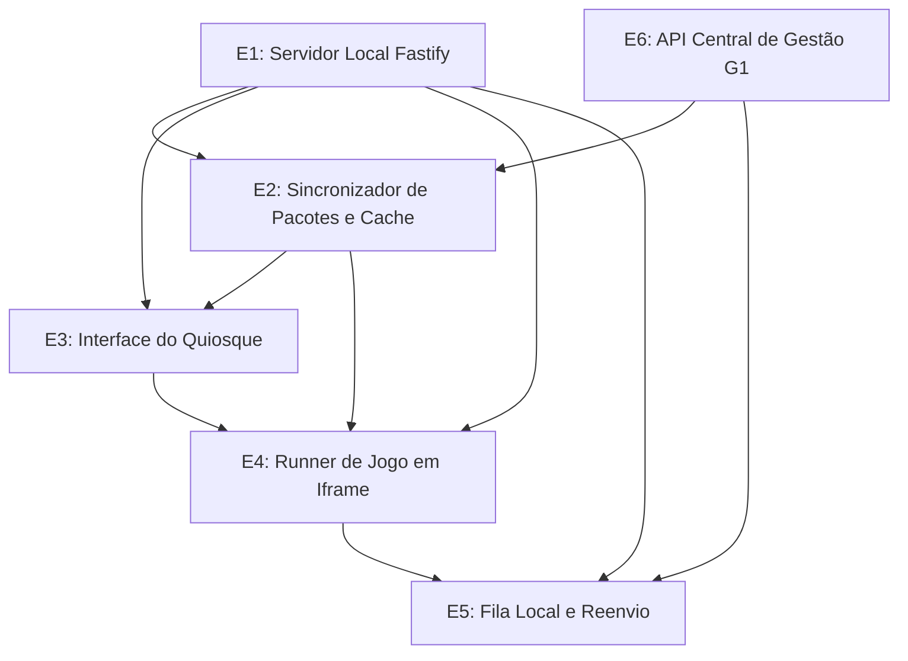

# DSM: matriz de dependências estruturais (G3)

Mapeamento de dependências entre módulos e serviços da estação local do Recreio Arcade. O documento orienta o planejamento das sprints e define a ordem de implementação para a entrega E2.

---

## 1. Visão geral

| Campo | Descrição |
| --- | --- |
| Nome do Produto | Fliperama Local (Recreio Arcade) |
| Equipe | Grupo 03 (G3) |
| Domínio analisado | Plataforma do quiosque: backend Fastify, interface React, execução em iframe, persistência em disco e integração com a API de Gestão (G1) |
| Objetivo da análise | Mapear dependências diretas, identificar gargalos de integração externa e organizar o trabalho em paralelo da equipe |
| Data | 27/09/2026 |

---

## 2. Elementos do sistema

Os seis elementos que compõem a arquitetura do fliperama local:

| ID | Elemento | Tipo | Descrição |
| --- | --- | --- | --- |
| E1 | Servidor Local Fastify | Serviço backend | Servidor HTTP local em Node.js. Entrega rotas da API local, serve os arquivos dos jogos descompactados e expõe endpoint de integridade (`GET /api/health`). |
| E2 | Sincronizador de Pacotes e Cache | Módulo de sincronização e I/O | Consulta o catálogo remoto da gestão, baixa os pacotes zip de jogos aprovados, valida o hash SHA-256 e descompacta tudo em `/var/lib/recreio-arcade/jogos/`. |
| E3 | Interface do Quiosque e Máquina de Estados | Frontend | Aplicação React em tela 4:3 (1024×768) navegável só por teclado. Controla os estados da sessão (`ATRAÇÃO`, `APELIDO`, `PAINEL`, `EM_JOGO` e `FIM`). |
| E4 | Runner de Jogo em Iframe | Runtime de execução | Janela isolada em `<iframe sandbox="allow-scripts">` sem `allow-same-origin`. Aplica timeouts de 15 segundos para carga e 5 minutos por partida, comunicando por `postMessage` (`ARCADE_INIT`, `ARCADE_MUDO` e `PLACAR`). |
| E5 | Fila Local e Reenvio de Placares | Módulo de persistência e fila | Grava partidas em `partidas.jsonl` com escrita atômica, guarda pendências em `fila/<id_partida>.json` e reenvia para a API central em intervalos crescentes. |
| E6 | API Central de Gestão (G1) | Serviço externo | Servidor remoto mantido pelo Grupo 01. Fornece catálogo oficial (`GET /api/jogos`), pacotes zip (`GET /api/jogos/{id}/pacote`) e ingestão de placares (`POST /api/placares`). |

---

## 3. Matriz DSM

O marcador `X` indica que o elemento da linha depende do elemento da coluna.

| Elemento \ Depende de | E1 (Fastify) | E2 (Cache) | E3 (Interface) | E4 (Runner) | E5 (Fila) | E6 (API G1) |
| --- | :---: | :---: | :---: | :---: | :---: | :---: |
| E1: Servidor Local Fastify | | | | | | |
| E2: Sincronizador e Cache | X | | | | | X |
| E3: Interface do Quiosque | X | X | | | | |
| E4: Runner de Jogo em Iframe | X | X | X | | | |
| E5: Fila Local e Reenvio | X | | | X | | X |
| E6: API Central de Gestão G1 | | | | | | |

---

## 4. Grafo de dependências

A seta `Origem --> Destino` indica que a conclusão da origem libera o destino (o destino depende da origem).

### Leitura do grafo

- E1 e E6 são pontos de partida. E1 fornece a base local de execução e E6 define os contratos de dados remotos.
- E2 precisa do Fastify (E1) para rodar e da API central (E6) para baixar metadados e arquivos zip.
- E3 usa as rotas locais de E1 e lê os metadados e capas que E2 descompacta no disco.
- E4 depende de E1 para servir os arquivos estáticos via HTTP, de E2 para ter os jogos em disco e de E3 para montar a tela de jogo e gerenciar o ciclo de vida do iframe.
- E5 depende do evento de placar vindo de E4, das rotas e tarefas de E1 e do endpoint de ingestão de E6.
- O grafo não tem ciclos. A ausência de dependências circulares simplifica o sequenciamento das tarefas.

---

## 5. Leitura das dependências

### Dependências críticas

| Origem | Depende de | Impacto | Observação |
| --- | --- | --- | --- |
| E2 (Sincronizador) | E6 (API Central G1) | Alto | Falhas de rede ou mudanças no schema remoto travam downloads. Mitigação: validar hash SHA-256 e usar mock local durante o desenvolvimento. |
| E4 (Runner) | E1 (Fastify) | Alto | O iframe precisa de um servidor local entregando a pasta `/jogos/:id/:versao/` com cabeçalhos corretos. Se o Fastify cair, nenhum jogo abre. |
| E4 (Runner) | E3 (Interface) | Médio | O React cuida da montagem, envio de mensagens e desmontagem do iframe. Manter a comunicação restrita ao `postMessage` evita acoplamento direto. |
| E5 (Fila Local) | E4 (Runner) | Alto | A fila precisa receber o evento `PLACAR` com formato válido. Mensagens incompletas do jogo impedem o registro. |
| E5 (Fila Local) | E6 (API Central G1) | Alto | A entrega depende da disponibilidade do servidor remoto e do token de estação. A fila local em disco e o `id_partida` protegem contra perda de dados e duplicações. |

### Frentes que podem avançar em paralelo

Com os contratos de rota do Fastify definidos, a equipe pode trabalhar em tarefas simultâneas:

- Interface e sincronizador: o React pode usar um `catalogo.json` estático para montar o painel de seleção enquanto o backend constrói o download e a extração dos pacotes zip.
- Execução e fila de placares: o runner de iframe pode ser validado com um jogo simples de teste antes do módulo de sincronização estar pronto. Ao mesmo tempo, a fila de reenvio pode ser implementada e testada com dados sintéticos.
- Telas iniciais do quiosque: a tela de atração, o mapa de teclas e a identificação do jogador dependem apenas de layout e validação de strings, avançando sem esperar regras de backend.

### Elementos que precisam vir antes

1. Servidor Fastify local (E1): precisa existir primeiro porque serve os assets locais, expõe as rotas consumidas pelo React e hospeda as rotas de execução do iframe.
2. Contratos de integração: os formatos de mensagem com o SDK do jogo (`ARCADE_INIT` e `PLACAR`) e o contrato da API central devem ser congelados antes do código para evitar retrabalho.
3. Mecanismo de persistência em disco: a escrita atômica com arquivo temporário e renomeação precisa estar pronta antes de plugar a fila e o cache de jogos.

---

## 6. Impactos no planejamento

### Ordem de implementação

1. Base do servidor local: inicialização do Fastify, entrega de arquivos estáticos e endpoint de integridade.
2. Execução de jogo isolado: montagem do iframe com sandbox, troca de mensagens via `postMessage` e liberação de memória após encerramento.
3. Catálogo e interface básica: navegação por teclado na grade de jogos a partir de dados locais.
4. Sincronização com a gestão: consumo de `GET /api/jogos`, download de pacotes zip e checagem de hash SHA-256.
5. Fila e reenvio de placares: gravação em `partidas.jsonl`, controle de pendências na pasta `fila/` e envio com espera crescente para a API central.
6. Ajustes de quiosque: tela de atração, mapa de teclas, validação de apelidos ofensivos e timeout por inatividade.

### Riscos de acoplamento

- Chamadas diretas do frontend para a API externa: o React não deve fazer requisições para a nuvem. Todas as chamadas passam pelo Fastify local para manter o quiosque funcional sem internet.
- Permissões no iframe: usar `allow-same-origin` quebraria o isolamento dos jogos, permitindo acesso ao armazenamento local do fliperama. O sandbox deve conter apenas `allow-scripts`.
- Operações bloqueantes na thread principal: download de arquivos grandes e escrita em disco não podem travar a resposta da interface aos comandos do teclado.

### Decisões arquiteturais adotadas

- Cache local como fonte de verdade: catálogo, ranking e arquivos dos jogos residem no disco da máquina, permitindo inicialização e jogo mesmo sem rede.
- Idempotência no envio de resultados: cada partida recebe um UUID (`id_partida`) antes de entrar na fila, permitindo retentativas sem duplicar pontuações no servidor central.
- Escrita atômica em arquivos de estado: gravações críticas usam arquivo temporário com renomeação para evitar arquivos corrompidos em caso de queda de energia.

---

## 7. Relação com as features fim a fim

Mapeamento entre os elementos da matriz e as features descritas em `docs/planejamento/features-fim-a-fim.md`:

| Feature | Elementos envolvidos | Dependências diretas | Entrega prevista |
| --- | --- | --- | --- |
| F4: Execução isolada em iframe com captura de pontuação via SDK | E1, E2, E3, E4 | E1 $\rightarrow$ E4, E2 $\rightarrow$ E4, E3 $\rightarrow$ E4 | E2 (28/09/2026) |
| F3: Navegação e seleção no catálogo de jogos locais | E1, E2, E3 | E1 $\rightarrow$ E3, E2 $\rightarrow$ E3 | E2 (28/09/2026) |
| F2: Identificação do jogador com validação de apelido | E1, E3 | E1 $\rightarrow$ E3 | E2 (28/09/2026) |
| F6: Sincronização de catálogo e download de zips com a gestão central | E1, E2, E6 | E1 $\rightarrow$ E2, E6 $\rightarrow$ E2 | E2 (28/09/2026) |
| F5: Registro de voto e enfileiramento de resultados offline | E1, E3, E4, E5, E6 | E4 $\rightarrow$ E5, E1 $\rightarrow$ E5, E6 $\rightarrow$ E5 | E2 (28/09/2026) e E3 (26/10/2026) |
| F1: Atração e inicialização autônoma do quiosque | E1, E3 | E1 $\rightarrow$ E3 | E3 (26/10/2026) |

---

## 8. Conclusão

### Principais aprendizados

- A matriz mostra que o fluxo entre componentes é acíclico, o que evita impasses na ordem de codificação.
- O Fastify local (E1) concentra a maior parte das dependências internas. Concluir sua estrutura básica destrava tanto o trabalho de interface quanto os módulos de execução e persistência.
- O isolamento entre a interface e a API externa garante que o quiosque opere sem internet, transferindo toda a responsabilidade de sincronização para tarefas em segundo plano.

### Ajustes no backlog e arquitetura

- Manter a execução isolada em iframe (F4) como primeiro marco funcional, validando o ciclo de vida do jogo antes de integrar a sincronização completa.
- Incluir casos de teste que simulem queda de energia e perda de conexão durante a escrita da fila local de placares.
